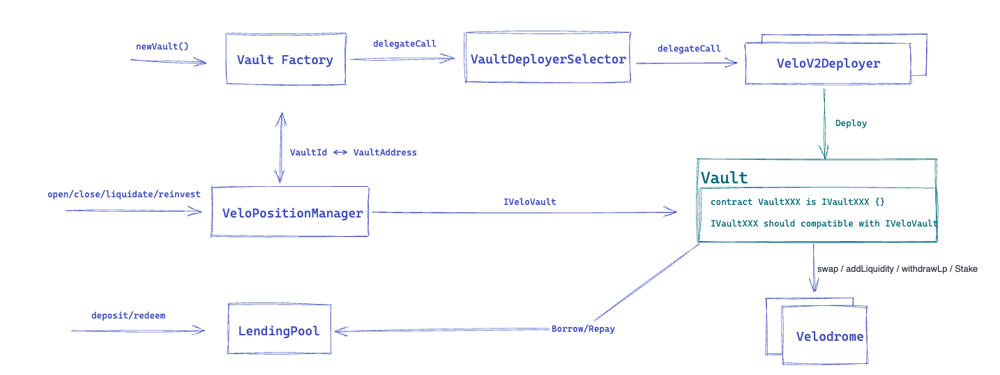

# Extra Finance Contracts

This repository contains the smart contracts source code of Extra Finance. 

As a leveraged farming protocol, our system comprises two components. On one side, there is a lending pool where users can deposit liquidity to earn passive income. On the other side, there is a farming vault where users can borrow liquidity from the lending pool to open leveraged farming positions.

## LendingPool

The LendingPool is a pool-share model protocol, where each asset has its own liquidity pool. Users can deposit assets into these pools and receive eTokens, which represent their share of the pool’s liquidity. Additionally, eTokens can be staked automatically in the StakingRewards contract to earn external rewards.

Unlike typical lending pools, liquidity in this protocol is accessible only to whitelisted vault contracts, specifically designed to allow farmers to open leveraged farming positions. Consequently, only whitelisted contracts created through the VaultFactory are permitted to call the borrow and repay functions within the lending pool.

### FarmingVault

The Vault contract manages farmers’ leveraged farming positions, with each Vault tied to a specific pair in Velodrome or Aerodrome and created through the VaultFactory. When users open a position, they first transfer their principal to the Vault contract. The Vault then borrows the corresponding asset from the lending pool and supplies the assets to Velodrome or Aerodrome, creating a leveraged position to farm rewards.

The Vault contract enforces checks on position leverage, borrowing limits for each vault, and other safeguards to prevent excessive leverage, ensuring user funds are not exposed to undue risk.

## Audits

You can find audit reports under the following links

- [BlockSec](https://github.com/blocksecteam/audit-reports/blob/main/solidity/blocksec_extrafinance_v1.0-signed.pdf)
- [Peckshield](https://github.com/peckshield/publications/blob/master/audit_reports/PeckShield-Audit-Report-ExtraFi-v1.0.pdf)
